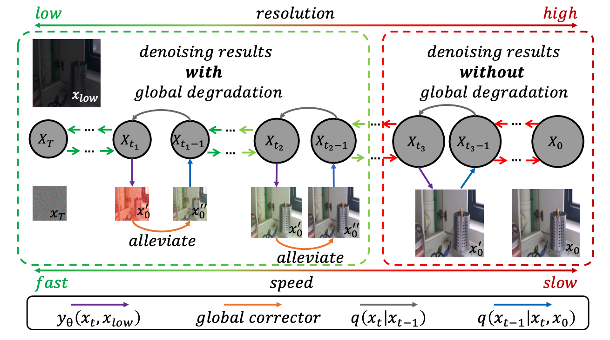

[](https://paperswithcode.com/sota/low-light-image-enhancement-on-lol?p=pyramid-diffusion-models-for-low-light-image)

# [IJCAI 2023] Pyramid Diffusion Models For Low-light Image Enhancement
### [Paper](https://arxiv.org/pdf/2305.10028.pdf) | [Project Page](https://github.com/limuloo/PyDIff) | [Supplement Materials](https://drive.google.com/file/d/1_c5nM_bQkdDMWASpY-3aoxf_YYzfWCwf/view)
**Pyramid Diffusion Models For Low-light Image Enhancement**
<br>_Dewei Zhou, Zongxin Yang, Yi Yang_<br>
In IJCAI'2023
## Overall


## Quantitative results
### Evaluation on LOL
The evauluation results on LOL are as follows
| Method | PSNR | SSIM | LPIPS |
| :-- | :--: | :--: | :--: |
| KIND | 20.87 | 0.80 | 0.17 |
| KIND++ | 21.30 | 0.82 | 0.16 |
| Bread | 22.96 | 0.84 | 0.16 |
| IAT | 23.38 | 0.81 | 0.26 | 
| HWMNet | 24.24 | 0.85 | 0.12 |
| LLFLOW | 24.99 | 0.92 | 0.11 |
| **PyDiff (Ours)** | **27.09** | **0.93** | **0.10** |

## Dependencies and Installation
```bash
git clone https://github.com/limuloo/PyDIff.git
cd PyDiff
conda create -n PyDiff python=3.7
conda activate PyDiff
conda install pytorch==1.7.0 torchvision torchaudio cudatoolkit=11.0 -c pytorch
cd BasicSR-light
pip install -r requirements.txt
BASICSR_EXT=True sudo $(which python) setup.py develop
cd ../PyDiff
pip install -r requirements.txt
BASICSR_EXT=True sudo $(which python) setup.py develop
```

## Dataset
You can refer to the following links to download the [LOL](https://daooshee.github.io/BMVC2018website/) dataset and put it in the following way:
```bash
PyDiff/
    BasicSR-light/
    PyDiff/
    dataset/
        LOLdataset/
            our485/
            eval15/
```

## Pretrained Model
<<<<<<< HEAD
You can refer to the following links to download the [pretrained model](https://drive.google.com/file/d/1-WScg2H0jwzVvdbw2HrXxLjs4We5A_SI/view?usp=sharing) and put it in the following way:
=======
You can refer to the following links to download the [pretrained model](https://drive.google.com/file/d/1-WScg2H0jwzVvdbw2HrXxLjs4We5A_SI/view) and put it in the following way:
>>>>>>> 862f8cc428450ef02822fd218b15705e2214ec2d
```bash
PyDiff/
    BasicSR-light/
    PyDiff/
    pretrained_models/
        LOLweights.pth
```

## Test
```bash
cd PyDiff/
CUDA_VISIBLE_DEVICES=0 python pydiff/train.py -opt options/infer.yaml
```
**NOTE: When testing on your own dataset, set 'use_kind_align' in 'infer.yaml' to false.** For details, please refer to https://github.com/limuloo/PyDIff/issues/6.

## Train
The PyDiff is available for non-commercial research purposes only. When requesting the complete training code, please contact us using your institutional or school email address exclusively for research purposes.

## Citation
If you find our work useful for your research, please cite our paper
```
@article{zhou2023pyramid,
  title={Pyramid Diffusion Models For Low-light Image Enhancement},
  author={Zhou, Dewei and Yang, Zongxin and Yang, Yi},
  journal={arXiv preprint arXiv:2305.10028},
  year={2023}
}
```

## Acknowledgement
Our code is partly built upon [BasicSR](https://github.com/XPixelGroup/BasicSR). Thanks to the contributors of their great work.
